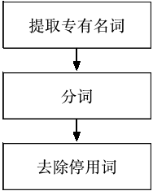
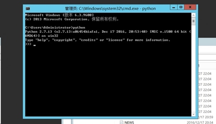

参赛单位：深圳信息职业技术学院软件学院

**2017年6月3日**

**第1章 引言**
====================================================================================================

**1.1 项目简要介绍**
----------------------------------------------------------------------------------------------------------

《大数据智能抓取和画像系统》是集互联网大数据事件爬取、事件属性提取和画像、可视化等功能于一体互联网软件。本软件能够自动爬取会议、展会、体育赛事、演唱会、突发异常天气等网站新闻，实现事件去重功能。本软件采用的技术有：网络爬虫、正文提取、分词、去重、生成语法树、语法树剪枝、大数据可视化、数据库、网页编程等。采用的编写语言为Python、Javascript和PHP。Python主要用于爬取分析存储数据，Javascript和PHP用于实现事件的可视化。

本项目使用的Python库有：selenium，re，beautifulsoup，requests，newspaper，mysqldb，ltp，simhash等。项目涉及到的Python库以及语料库资源均为开源免费。除此之外，为了利用海量的网络大数据，我们在实现相关功能时使用了免费的网络大数据资源。使用到的网络免费的网络资源有：百度搜索，百度指数，百度地图、百度新闻、百度Echarts。

图 1-1 本项目使用的编程语言及利用的网络资源
**1.2 项目背景**
------------------------------------------------------------------------------------------------------

“人类正从IT时代走向DT时代，”2014年三月在北京举行的一场大数据产业推介会上，阿里巴巴集团创始人马云在主题演讲中发表了他的这一观点。目前以大数据为核心的DT时代已经成为现实。在DT时代，可以说能否充分利用大数据成为一个公司能否占据产业制高点的关键。

对于民航业领域，社会事件的发生，会很大程度影响旅客的出行需求变化，从而影响航空公司飞机运力投放、航班编排、票价策略调整等，对互联网事件的准确抓取和分析能够帮助航空公司更好的服务市场、服务旅客、提升收益。而互联网事件数据，是其中非常重要的一种数据来源。大数据有5V特点。其中Volume（大量）、Value（低价值密度）导致大数据采集利用困难，人工处理更不可能实现。这这种背景下催生出如网络爬虫、自然语言处理等蓬勃发展的新兴技术。但是，针对社会事件的抓取和画像目前并没有现成、成熟的软件工具可以自动实现。因此开发一套大数据事件智能抓取、画像软件系统非常必要

**1.3 项目的创新点**
----------------------------------------------------------------------------------------------------------

互联网新闻的特点是：格式不一，新闻内容包含的属性不一，因此从互联网新闻的网页内容中提取出事件统一格式的各种属性并进行可视化展示具有较大挑战。针对开发过程中出现的种种问题，项目团队成员充分运用大数据思维，基于网络爬虫、自然语言处理、大数据可视化技术开发出多个新颖的实用算法，经测试它们均能获得较好效果。这些算法简单描述如下，本文档第四章（详细设计）中有详细描述：

1.  基于网络大数据的关键词提取算法：由于互联网内容含有各类词语，新词层出不穷。如果利用传统的tf-idf方法提取关键字，很多词语在离线idf库（逆向文件频率）中不存在，导致关键字提取精度下降。本项目利用百度搜索返回的结果数目代替离线idf库，取得较好效果。

2.  事件热度提取算法：事件热度在源网页往往没有直接体现，本项目同样利用百度搜索返回的结果数目计算事件热度。

3.  主要影响人群提取算法：事件主要影响人群年龄段在源网页中也没有直接体现。我们首先提取相关事件关键字，再在百度指数中搜索关键字，然后爬取百度指数中相关css中svg图片的特征，成功地获取了主要影响人群年龄段的数据。

4.  场馆城市名提取、城市经纬度提取算法：有不少事件（展会，演唱会）只提供举办场馆信息，但是没有指明所在城市。为了获取本项目创新地利用了百度地图API搜索事件发生地点的经纬度数据，进而同样基于百度地图API用经纬度数据得到城市名称，此算法获得的经纬度数据也将使用于可视化算法中。

5.  会议事件的爬取会议名、举办时间、举办地点提取算法：各类会议事件都以新闻的形式呈现，所以不能够直接通过爬取网页提取相关的事件属性信息。我们首先利用newspaper库提取新闻正文，然后利用语法分析、语法树剪枝的方法成功提取了会议的会议名、举办时间、举办地点。

6.  可视化技术：为了可视化效果更加直观，本项目利用事件发生地点的经纬度在地图上直接标注出事件发生位置。我们首先用PHP语言把事件所有属性和可视化格式封装成JSON格式，然后把JSON数据发送至百度Echart即可实现美观的在线可视化功能。

**第2章 需求分析**
========================================================================================================

**2.1 功能需求**
-------------------------------------------------------------------------------------------------------

下表为本软件的需求分析及解决方案：

| 功能需求                                                                                                                         | 需求分析及解决方案                                                                                                                                                                                                                                                                                                                                                                 |
|----------------------------------------------------------------------------------------------------------------------------------|------------------------------------------------------------------------------------------------------------------------------------------------------------------------------------------------------------------------------------------------------------------------------------------------------------------------------------------------------------------------------------|
| 互联网事件抓取功能：实现互联网事件天级或更高频次抓取，采集政治会议、展会、体育赛事、演唱会、突发异常天气等各类中比较主要的事件。 | 该功能需求主要对数据采集方面提出较高要求。对于政治会议、展会、体育赛事、演唱会、突发异常天气等事件，我们都尽量选择了多个网站进行爬取。由于多个天气网站查询到的天气预警结果相同，所以只查询了中国天气网。因为每个网站格式和所包含内容各不相同，所以都需要使用定制的方法进行爬取。本项目主要利用selenium，re，beautifulsoup，requests实现自动爬取功能。本项目爬取的网址如表2-1所示。 |
| 事件的去重功能：一是不同数据源（网站）的事件去重，二是不同天抓取的事件去重。                                                     | 该功能要求软件具有去重功能。经过调查我们选定了被广泛使用的simhash方法实现去重功能，取得了较好效果。                                                                                                                                                                                                                                                                                |
| 事件画像建模功能：事件属性自动化提取，属性包括主办方级别、影响区域范围、影响力度、影响人群等。                                   | 该功能需求主要对数据采集和数据分析提出较高要求。由于事件多个属性隐含在源网页，甚至不包含在源网页中，所以很难被直接从网页中提取。本项目采用多种算法配合尽量提取事件属性。                                                                                                                                                                                                           1.  主办方级别：采用字符串匹配的方法进行识别。                                                                                                                                                                                                                                                                                                                                  2.  影响力度：利用百度返回的结果数目计算影响力度。                                                                                                                                                                                                                                                                                                                                  3.  影响人群：提取事件关键字，利用百度指数获得影响人群画像，再通过网络爬虫软件抓取相关信息。                                                                                                                                                                                                                                                                                        |
| 可视化展现功能：可视化展示事件的影响情况。                                                                                       | 可视化展示核心是如何美观、直观地展示数据。展示数据主要是化展示事件的影响情况。我们通过百度地图API获得事件发生地点的经纬度，进而把事件直观地标注在地图上，同时通过柱状图表示每个地点发生事件的数量。                                                                                                                                                                                |

表2-1 需求分析及解决方案

| 网站       | url                                        | 分类     |
|------------|--------------------------------------------|----------|
| 中国天气网 | http://www.weather.com.cn/alarm/\#         | 异常天气 |
| 大麦网     | https://s.damai.cn/ticket/sports.html      | 演唱会   |
| 爱稻草     | http://www.idaocao.com/                    | 演唱会   |
| 百度网     | http://www.baidu.com                       | 新闻时政 |
| 新华网     | http://www.news.cn/politics/               | 新闻时政 |
| e展网      | http://www.eshow365.com/                   | 展会     |
| 大麦网     | https://s.damai.cn/ticket/sports.html      | 体育赛事 |
| 永乐票务   | http://www.228.com.cn/category/tiyusaishi/ | 体育赛事 |

2-2 本项目数据来源网站

**2.2 运行环境**
-------------------------------------------------------------------------------------------------------

本项目推荐软硬件运行环境如表2-1所示：

| CPU            | Intel酷睿 i5 4590及以上                                                                               |
|----------------|-------------------------------------------------------------------------------------------------------|
| 内存           | 4GB及以上                                                                                             |
| 硬盘           | 50GB及以上                                                                                            |
| 操作系统       | Microsoft Windows 10, 64位操作系统                                                                    |
| 其它软件       | CPython 2.7.10以上，推荐2.7.13                                                                         XAMPP 3.2.2，MySQL 5.7                                                                               Chrome 59.0.3071.109以上                                                                               |
| 主要开发库版本 | beautifulsoup 4.6.0，pandas 0.20.2，requests 2.18.1，selenium 3.4.3，pyltp 0.1.9.1，newspaper 0.1.0.7 |

表 2-3 软件运行环境

**第3章 总体设计**
=========================================================================================================

**3.1 总体结构**
-------------------------------------------------------------------------------------------------------

本软件由Python实现数据爬取、分析、属性提取功能，由PHP实现大数据可视化功能。处理流程为：

第一步：抓取网页原始数据。

第二步：把原始数据经过简单去重（去掉标题完全一样的事件），存入数据库中。

第三步：利用基于Python的网页数据提取功能（针对除源网站外的网站），正文提取功能，去重功能，分词功能，生成语法树功能，语法树剪枝功能实现各属性提取。

第四步：把属性存入CSV文件中，这一步是用追加的方式进行的。

第五步：利用PHP进行可视化。

本软件总体结构如图所示。

图 3-1系统总体结构

**3.2处理流程设计**
----------------------------------------------------------------------------------------------------------

### **3.2.1 网站数据抓取处理流程**

本软件网站数据抓取之后即把抓取到的原始数据原始数据存入MySQL数据库中，其通用处理流程如下图所示，详细数据表结构在4.1.1-4.1.4中有描述。

图3-2网站爬虫处理流程图

### **3.2.2 各事件处理流程**

经分析本软件需求中需要提取的属性可以分为可直接提取属性、可间接从源网页提取属性、可从外部网页提取属性。我们处理顺序流程同样为首先提取可直接提取属性，然后分析源网页，从源网页中提取属性，最后从外部网页提取属性。本软件各事件提取属性表如下所示：

| 事件类型\\属性提取 | 可直接提取属性 | 可间接从源网页提取属性                                                                                                                                                                      | 可从外部网页提取属性                                                  |
|--------------------|----------------|---------------------------------------------------------------------------------------------------------------------------------------------------------------------------------------------|-----------------------------------------------------------------------|
| 天气               | 标题           | 开始日期，结束日期，地点，事件一年内频率，事件历史悠久程度，事件类型（是否会议,是否体育赛事,是否天气,是否展会，是否演唱会），影响社会人群，是否有固定的参与人群，事件一年内频率             | 主要影响年龄层（儿童，青年，成年，老年），事件类型（是否会议,事件热度 |
| 演唱会             | 标题           | 开始日期，结束日期，事件一年内频率，事件历史悠久程度，事件类型（是否会议,是否体育赛事,是否天气,是否展会，是否演唱会），影响社会人群，是否有固定的参与人群，事件一年内频率                   | 地点，主要影响年龄层（儿童，青年，成年，老年）, 事件热度              |
| 展会               | 标题，地点     | 开始日期，结束日期，事件一年内频率，事件历史悠久程度，事件类型（是否会议,是否体育赛事,是否天气,是否展会，是否演唱会），影响社会人群，是否有固定的参与人群，事件一年内频率，事件历史悠久程度 | 主要影响年龄层（儿童，青年，成年，老年）                              |
| 体育赛事           | 标题           | 开始日期，结束日期，事件一年内频率，事件历史悠久程度，事件类型（是否会议,是否体育赛事,是否天气,是否展会，是否演唱会），影响社会人群，是否有固定的参与人群，事件一年内频率                   | 地点，主要影响年龄层（儿童，青年，成年，老年）, 事件热度              |
| 会议               |                | 标题，开始日期，结束日期，地点，事件一年内频率，事件历史悠久程度，事件类型（是否会议,是否体育赛事,是否天气,是否展会，是否演唱会），影响社会人群，是否有固定的参与人群，事件一年内频率       | 主要影响年龄层（儿童，青年，成年，老年），事件热度                    |

表3-1各事件属性处理流程表

**第4章 详细设计**
=========================================================================================================

**4.1 主要数据结构设计**
---------------------------------------------------------------------------------------------------------------

本软件抓取网页数据后将原始网页数据存于MySQL数据库中，下面为各数据表结构描述。

### **4.1.1 news表**

用于存储新闻网页数据。news表结构如下：

| 名称        | 类型    | 长度 | 可否为空 | 主键        |
|-------------|---------|------|----------|-------------|
| id          | int     | 255  | Not null | Primary key |
| start\_time | varchar | 255  | null     |             |
| endtime     | varchar | 100  | null     |             |
| title       | varchar | 100  | null     |             |
| url         | varchar | 100  | null     |             |
| contents    | text    | 0    | null     |             |

表 4-1 news表设计结构

### **4.1.2 sport,sing表**

用于存储体育赛事和演唱会数据。sport，sing表结构如下：

| 名称        | 类型    | 长度 | 可否为空 | 主键        |
|-------------|---------|------|----------|-------------|
| id          | int     | 255  | Not null | Primary key |
| start\_time | varchar | 255  | null     |             |
| endtime     | varchar | 100  | null     |             |
| title       | varchar | 100  | null     |             |
| url         | varchar | 100  | null     |             |
| changguan   | varchar | 100  | null     |             |

表 4-2 sport表设计结构

### **4.1.3 weather表**

用于存储天气数据。weather表结构如下：

| 名称        | 类型    | 长度 | 可否为空 | 主键        |
|-------------|---------|------|----------|-------------|
| id          | int     | 255  | Not null | Primary key |
| start\_time | varchar | 255  | null     |             |
| endtime     | varchar | 100  | null     |             |
| url         | varchar | 100  | null     |             |
| title       | varchar | 50   | null     |             |

表 4-3 weather表设计结构

### **4.1.4 eshow表**

用于存储展会数据。eshow表结构如下：

| 名称        | 类型    | 长度 | 可否为空 | 主键        |
|-------------|---------|------|----------|-------------|
| id          | int     | 255  | Not null | Primary key |
| start\_time | varchar | 255  | null     |             |
| endtime     | varchar | 100  | null     |             |
| url         | varchar | 100  | null     |             |
| title       | varchar | 255  | null     |             |
| place       | varchar | 100  | null     |             |
| hangye      | varchar | 100  | null     |             |
| hold\_num   | varchar | 100  | null     |             |
| hold\_cycle | varchar | 100  | null     |             |
| zhanguan    | varchar | 100  | null     |             |
| zhuban      | varchar | 255  | null     |             |

表 4-4 eshow表设计结构

4.2 **核心算法详细设计**
------------------------

### **4.2.1基于网络大数据的关键词提取算法**

传统的自然语言处理技术中提取关键词的算法为经典的TF-IDF（Term Frequency–Inverse Document Frequency）算法。实际上是：TF \* IDF，TF词频(Term Frequency)，IDF逆向文件频率(Inverse Document Frequency)。TF表示词条在文档d中出现的频率。IDF的主要思想是：如果包含词条t的文档越少，也就是n越小，IDF越大，则说明词条t具有很好的类别区分能力。

热门的tf-idf算法实现有结巴分词等等。这些tf-idf算法的实现依赖一个离线的idf词库，该词库中存储了大量词汇的idf值。但是，互联网新词汇层出不穷，这些新词汇往往不出现在离线的idf词库中。

另外一些短语，诸如包含在《》，「」，（）等符号中的短语，不宜分词后再计算IDF。例如：《我的大学》，“我的大学”应该视为专有名词，若分词为“我 的 大学”再计算IDF则没有意义。另外演唱会等事件常常包含此类情况。若可以对这些专有名词直接计算IDF，则关键词提取可实现更高精度。但是，离线IDF库不可能包含所有专有名词。

若一个词不出现在IDF词库中，其被挑选为关键词的概率会反常地变大，这就导致了关键词提取精度的下降。为了避免这个问题，我们运用大数据思维，利用百度搜索返回的结果数计算一个词的IDF。设要计算词汇w的IDF。首先利用百度搜索w，得到搜索结果的数量n(w)。例如搜索“杰伦”，搜索结果如下图，搜索结果的数量n(“杰伦”)=11900000。

图4-1 在百度中搜索“杰伦”的结果

定义大数据逆向文本率BDIDF(Big Data Inverse Document Frequency)如下式：

$BDIDF(w) = \\log\_{10}(\\frac{1\*10^{8}}{n\\left( w \\right) - 1})$ \[1\]

其中n(w)为词汇对应的搜索结果的数量，1 \* 108 （1亿）为百度搜索得到的最大搜索结果数量。例如n（“中国”）=1 \* 108，n（“上海”）=1 \* 108。我们把这个最大搜索结果数量作为文本总量使用。显然地BDIDF（“中国”）≈0，BDIDF（“杰伦”）≠0。

用以上BDIDF方法可以得出所有词汇的逆向文本率。本项目中关键字主要用于标题去重，而标题中某一词汇出现的频率一般为1，所以我们直接使用BDIDF取代TF-IDF，即一个词汇的重要程度等于1\*BDIDF。选择1\*BDIDF值最高的n个即为关键词。

下面是本项目关键字提取的分词算法除了分词、去除停用词之外，还有提取专有名词的步骤，流程图如下：

图4-2 计算关键字提取的分词算法流程图

BDIDF算法实现较为简洁，流程图如下：

![]_image/大数据智能抓取和画像软件设计文档/19-46-04.png)

图4-3 计算BDIDF的算法流程图

### **4.2.2主要影响人群提取算法**

每个事件关注的人群会不同，从小孩到老年人不等，当天发生的事件会影响到他们的出行计划，像体育赛事，演唱会，G20峰会等等，人们的出行计划会影响到当地的航空的客流量，能够准确预估某个事件的影响人群对合理分配航空资源具有重要意义。

但是主要影响人群的数据很难直接从源网页读取，因此必须考虑其它途径。百度指数是一个很好的选择。百度指数为我们提供了友好的人群画像功能，我们可以从中抽取想要的信息，如下图为搜索“g20”关键字的人群年龄分布：

图 4-4 百度指数人群画像功能中的人群属性

第一步：我们使用4.2.1所述算法从事件标题中提取出关键字，第二步：将关键字注入到百度指数搜索框中进行查找，第三步：从网页抓取抓取年龄分布数据。

抓取年龄分布数据相对较为复杂，经过我们分析，上图年龄分布的图片是svg格式。我们利用爬虫软件定位了对应svg渲染的代码，直接获取了每个年龄段柱状图的高度，进而转化比例数值，选取比例最高的人群即为主要影响人群。成功地解决了主要影响人群提取的问题。

本算法流程图如下：

图 4-5 主要影响人群提取算法流程图

### **4.2.3场馆城市名提取、城市经纬度提取算法**

对于只给有场馆名的事件还必须找出事件发生城市。我们利用百度地图API实现了一功能。第一步：通过百度地图API获取该场馆的经度和纬度。第二步：通过获取的经度和纬度再次调用百度地图API获得所在城市。该算法获得的经度和纬度同样可以用于可视化展示。本算法需要用到json格式解析百度地图API返回的。

本算法流程图如下所示：

图 4-6 场馆城市名提取、城市经纬度提取算法流程图

### **4.2.4事件去重算法**

从不同网站捉取回来的事件有些事相同的，去重后助于减轻我们今后对数据进行分析的量。本项目利用simhash进行去重。simhash是google用来处理海量文本去重的算法。Simhash能够将一个文档，最后转换成一个64位的字节，暂且称之为特征字，然后判断重复只需要判断他们的特征字的距离是不是&lt;n（根据经验这个n一般取值为3），就可以判断两个文档是否相似。

本项目去重算法第一步：去除标题完全相同的事件。 第二步：计算各个事件的simhash值。 第三步：各获取两个样本之间的海明距离，根据经验，海明距离在0-3之间的算重复事件，判定为重复时间则去重。

图 4-7 simhash 原理图

图 4-8 本项目事件去重算法流程图

### **4.2.5会议事件的爬取会议名、举办时间、举办地点提取算法**

由于会议事件都是出现在新闻中，所以会议的会议名、举办时间、举办地点。会议事件的属性提取是本软件设计的难点。我们运用了正文提取和自然语言处理技术实现了会议的会议名、举办时间、举办地点提取。

我们的算法步骤如下：

第一步：在百度搜索“峰会 举行”或“会议 举行”字样。

第二步：进入百度“最新”页面，该页面下有近期的“峰会 举行”新闻列表。

第三步：使用newspaper库获取近期新闻的正文。

第四步：对正文分句。

第五步：由于会议名称时间地点描述一般在第一段，第一句，所以获取正文第一句用于属性提取。例句为：“*中青在线杭州6月22日电（实习生 管婷婷 中国青年报·中青在线记者 董碧水）记者从杭州市人民政府今天举行的新闻发布会获悉，2017全球私募基金西湖峰会将于6月24日在杭州召开。*”

第六步：分词、生成语法树，这里我们使用ltp的语法依存树。依存树的中心为动词，这个特点有利于我们提取关键语法树（包含会议名、举办时间、举办地点的最小子树）。上面例句生成的语法依存树为下图所示：

图 4-9 例句生成的语法依存树

第七步：获取根为“举行”或“召开”的子树，下图为该例句获取到的子树。可以发现该子树中包含有1个FOB（前置宾语）子树，3个ADV（状中关系）子树。

图 4-10 例句提取的子树

第八步：进行语法树剪枝，删除与根节点为COO（并列关系）依赖关系的子树。（本例句没有COO子树）。

第九步：提取SBV（主谓关系）或者FOB（前置宾语）的子树作为会议名称，若两种关系同时存在，则优先选择FOB子树。故该例句提取到的会议名称为“2017全球私募基金西湖峰会”。

第十步：提取含有nt词汇的ADV（状中关系）子树作为时间，含有ns词汇的ADV（状中关系）子树作为地点。并去除介词（p）。故该例句提取时间为：“6月 24日”，地点为：“杭州”。

本属性提取算法能够处本属性提取算法能够正确处理类似以下句型：

1.  2017年夏季达沃斯论坛新领军者年会将于6月27日至29日在大连举行，目前共有来自80多个国家的超过2000位政、商、学、文等各界领袖注册参会。本次会议主题为“在第四次工业革命中实现包容性增长”。

2.  2017年亚洲媒体峰会6月6日在青岛举行，中共中央政治局委员、国务院副总理刘延东出席开幕式并致辞，强调要强化媒体责任，促进媒体合作，为落实联合国2030年可持续发展议程、构建人类命运共同体注入更多“正能量”。

3.  中青在线杭州6月22日电（实习生 管婷婷 中国青年报·中青在线记者 董碧水）记者从杭州市人民政府今天举行的新闻发布会获悉，2017全球私募基金西湖峰会将于6月24日在杭州召开。

除了上述句型，本算法仍旧有一些句型不能够顺利处理。团队成员在持续努力完善该算法。

### **4.2.6可视化**

我们使用PHP把需要绘图的数据封装成json格式发送给百度Echarts API。所有事件按照日期进行可视化。我们利用事件发生地的经纬度结合事件类型把事件直观地标注在地图上，如图 4-11所示。图 4-12、图 4-13 分别为事件占比，事件出现次数可视化和事件属性（简略）列表。

图 4-11 按事件的总类和位置用不同的颜色标记在地图上，

鼠标在对应位置停留时会显示出事件名称和发生日期

图 4-12 事件占比，事件出现次数可视化

图 4-13 事件属性（简略）列表

**第5章 使用说明**
=========================================================================================================

**5.1 安装与初始化**
-----------------------------------------------------------------------------------------------------------

1.  数据库初始化

将源代码项目sql文件夹下的softbei.sql文件导入到数据库中

图 5-1 数据库初始化

1.  python环境安装

python官网下载[64位python2.7](https://download.jetbrains.8686c.com/python/pycharm-professional-2017.1.4.exe)安装包

运行安装：

图 5-2 Python运行环境安装

1.  python依赖库安装

方法一：使用pycharm自带的图形界面安装

方法二：pip直接安装

下面安装依赖库会同时用到上面介绍的方法：

打开pycharm,file-&gt;setting-&gt;Project Interpreter，点击右边的绿色+号输入需要的库进行安装。

bs4(网页内容匹配库)：

命令:`pip intall bs4`

newspaper（新闻内容提取库）：

命令:`pip intall newspaper`

图 5-4 newspaper运行环境安装

MySQLdb(数据库链接驱动，需独立下载)：

图 5-5 MySQL运行环境安装

pandas：

命令：`pip install pandas`

simhash：

命令：`pip install simhash`

selenium：

命令:`pip install selenium`

安装好selenium后需要配置chrome驱动

1. 将chrome驱动放置google目录下

图 5-6 chrome driver安装

2. 添加环境变量

图 5-7 chrome driver环境变量配置

pyltp：

安装命令: `pip install pyltp`

需要： [visual c++](https://www.microsoft.com/en-us/download/confirmation.aspx?id=44266)环境支持，否者抛出如下异常

图 5-8 未安装VC++抛出异常

官网下载后vc++后，安装。

图 5-8 VC++安装

再次执行`pip install pyltp`命令即可安装成功。

gensim：

安装命令:`pip install gensim`

其他库安装：

`pip install pandas`

`pip install requests`

**5.2 软件主要功能的使用说明**
---------------------------------------------------------------------------------------------------------------------

爬取和分析数据，直接运行main.py即可

**可视化：**

若需要本地运行数据可视化前端代码，请配置好数据库，php环境，运行softbei/visual/index.php文件即可